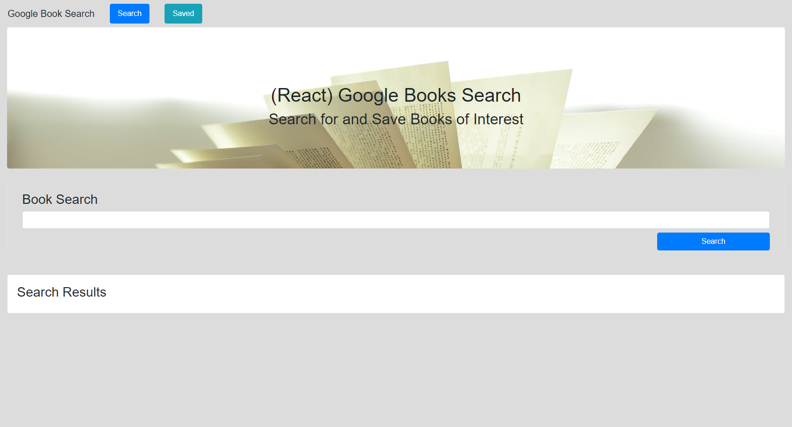
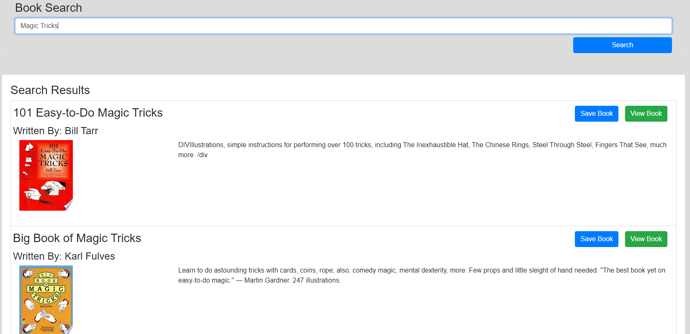
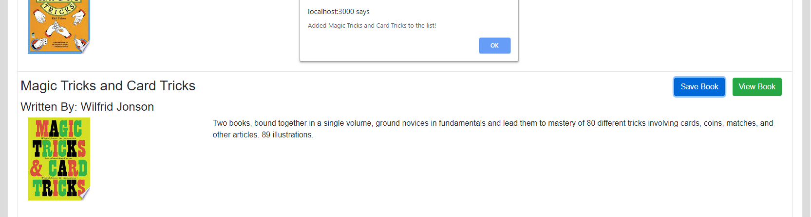

# GoogleBookSearch

## About

This is a Google Books Search app, utilizing the Google Books API.  It will allow the user to search out information on books, and save the book information to a database for later viewing, or view the book's information on the Google Books website directly.

## Technologies Used
* ReactJS
* ExpressJS
* Mongoose/MongoDB
* HTML
* Bootstrap CSS

## Deployed Site
https://gd-googlebooksearch.herokuapp.com/

## Images
### Home
Here, the user can search for favorite books.

### Search/Results

The "Search Results" section will show the API result data from the search.

The user can click the "View Book" button to open a new tab to the Google Books site for that book. 
Finally, the user can save the book's information to the database via the "Save Book" button.  A pop-up will show that the book was saved to the database.

### Saved Books

This page will show all the saved books the used has selected.  

Here is a populated version with books saved to the database.

The user can then either to view the book on the Google Books site via the "View Book" button, or remove the book from the saved database by using the "Delete Book" button.

